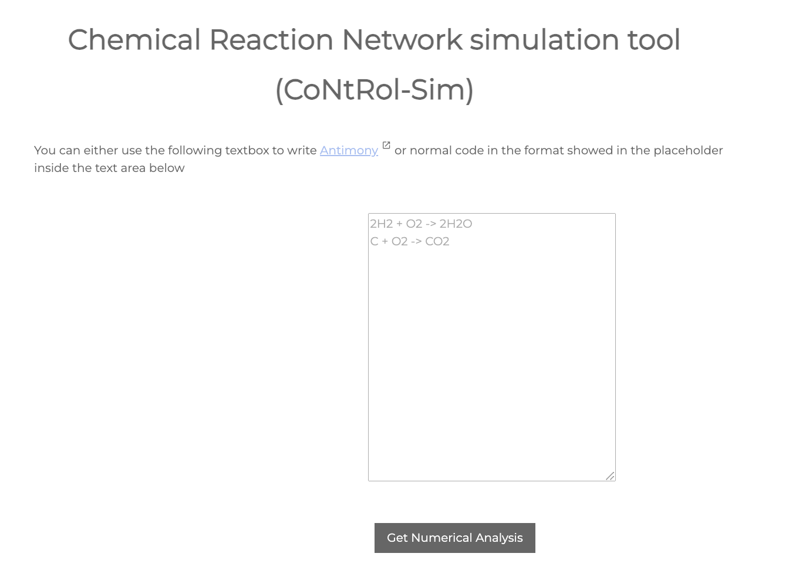
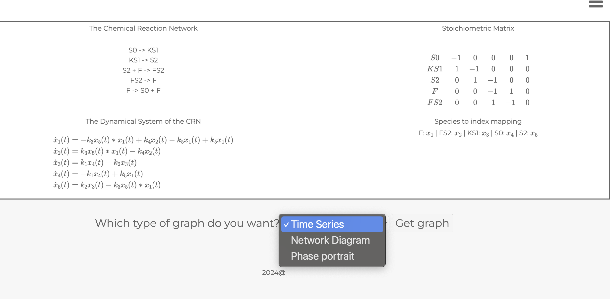
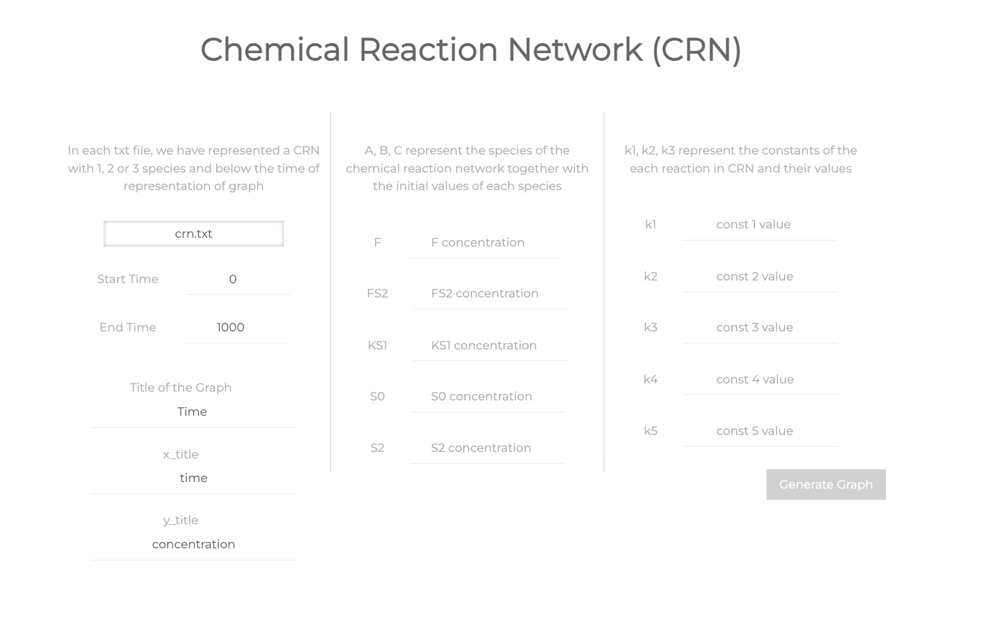
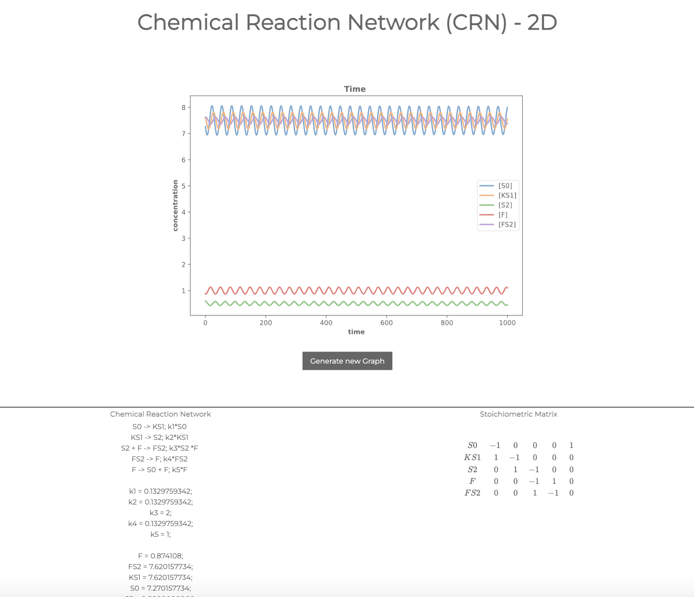
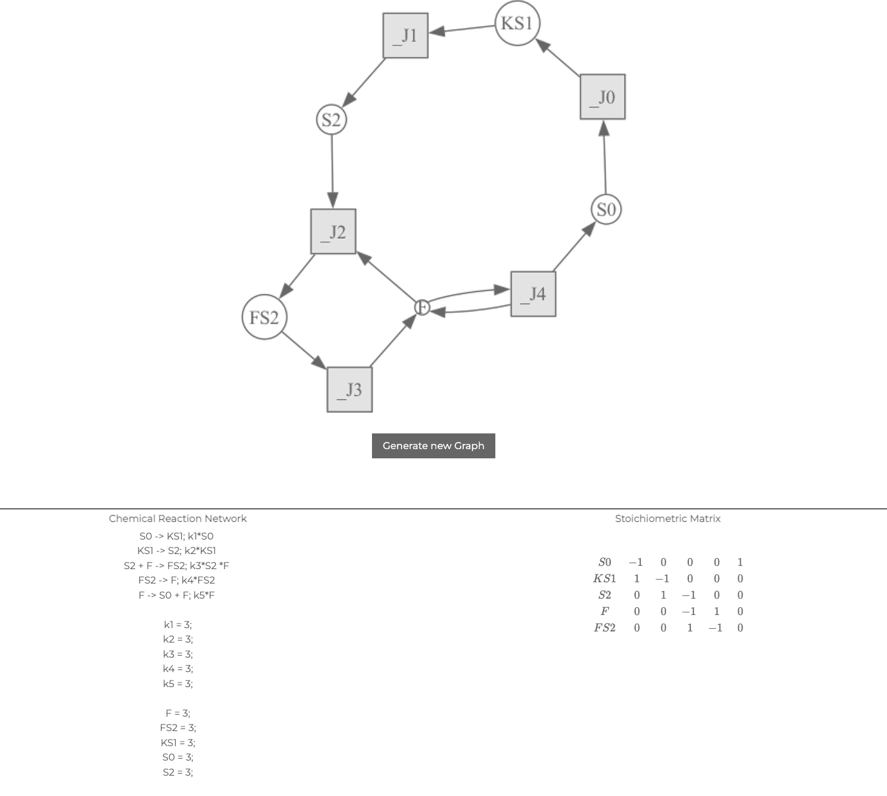

# Open-CoNtRol, an open source web Chemical Reaction Network visualizer.

Can use a simple way to input chemical reaction networks


Or use [antimony](https://tellurium.readthedocs.io/en/latest/antimony.html#introduction-and-basics) to input them copy-paste style easier (or the simpler format from the placeholer in the image below:

yes i know it's not centered leave me alone

You first get a numerical analysis of your system


From which you can graph your results in different shenanigans and schemes

The default basic one is the Time series representation, giving you a page from which you can select your initial values for 
species and reaction rates


and from there outcomes this beauty



A network diagram (DSR Graph) is similar, except you don't have to fill out the complaint from beforehand


The phase portrait is neat in that you can select either 2 or 3 species to represent and it plots a 2D and respectively 3D phase portrait


# Installation
Please note pygraphviz has to be installed *beforehad*. So if you're not on unix (for some reason) meaning the bellow command doesn't work, please consult the installation guides [here](https://pygraphviz.github.io/documentation/stable/install.html).

## To run the flask web app:

#### Linux
```bash
git clone https://github.com/viktorashi/Open-CoNtRol.git
cd Open-CoNtRol
sudo apt-get install graphviz graphviz-dev
pip install pygraphviz
pip install -r requirements.txt
```

#### Then to run the server
```bash
chmod +x ./set_vars.sh 
chmod +x ./run_script.sh
./set_vars.sh 
./run_script.sh
```


If it doesn't find you a proper port try:

```bash
python -m flask run
```


#### MacOS / OS X
Make sure you have [homebrew](https://brew.sh)
```bash
/bin/bash -c "$(curl -fsSL https://raw.githubusercontent.com/Homebrew/install/HEAD/install.sh)"
```
```bash
git clone https://github.com/viktorashi/Open-CoNtRol.git
cd Open-CoNtRol
brew install graphviz
pip install pygraphviz
pip install -r requirements.txt
```
Note: if the `pygraphviz` installation fails, comment out the entry for `pygraphviz` in `requirements.txt` (example)
```
...
#pygraphviz==1.13
...

```
and run the following command:
```bash
pip install --config-settings="--global-option=build_ext" \
            --config-settings="--global-option=-I$(brew --prefix graphviz)/include/" \
            --config-settings="--global-option=-L$(brew --prefix graphviz)/lib/" \
            pygraphviz
```

#### Then to run the server
```bash
chmod +x ./set_vars.sh 
chmod +x ./run_script.sh
./set_vars.sh 
./run_script.sh
```


If it doesn't find you a proper port try:

```bash
python -m flask run
```

#### On Windows
i'm not really sure tbh, i just use [WSL](https://learn.microsoft.com/en-us/windows/wsl/install)

It will inherit the app name and options from `.flaskenv`
### Or simply, if you just want to run it without contributing, create a virtualenv however way you want ( [virtualenvwrapper](https://virtualenvwrapper.readthedocs.io/en/stable/install.html#basic-installation) recommended by yours truly) and install it there as a package with:
```bash
pip install git+https://github.com/viktorashi/Open-CoNtRol.git
flask --app open_control --debug run
```
### In the above case you can't really configure the host ip adress that the server will be running on like in the first example. In order to do that you'd need to download at least the script "run_script.sh" from the repo then give it execute permissions and run with
```bash
chmod +x ./run_script.sh
./run_script.sh
```
